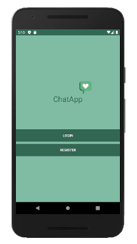

# ChatApp

## Overview
### Final project on the subject of "Cloud Computing in mobile applications for the Android platform".
ChatApp is a simple app which helps you communicate with your friends.

## Screenshots

## Features:

1. Sign up form for new user to create an account. A new user record is created in Google Firebase. If an already existing user tries to sign up, he is prevented in doing the same.
2. Login Page to allow only authorized users to login. Performs validation for username and password match. 
3.  Home page where users can check their dialogs and friends list.

## Technology Used:

1.	Android Studio 3.6.2
2.	Firebase database
3.	Android Gradle version 3.6.3
